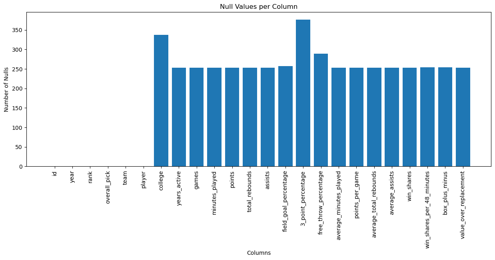
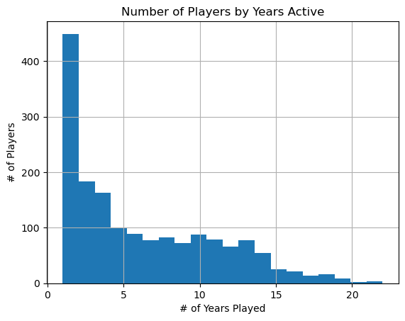
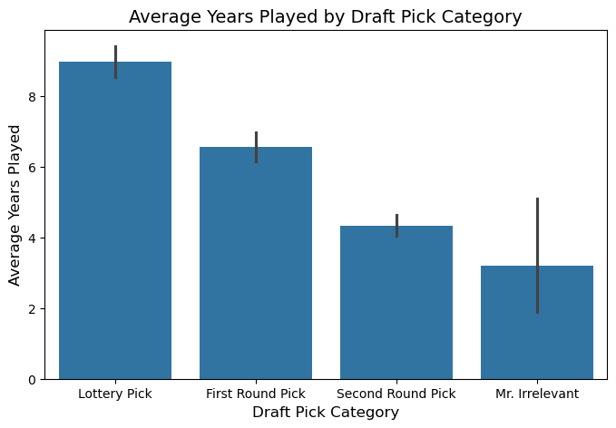
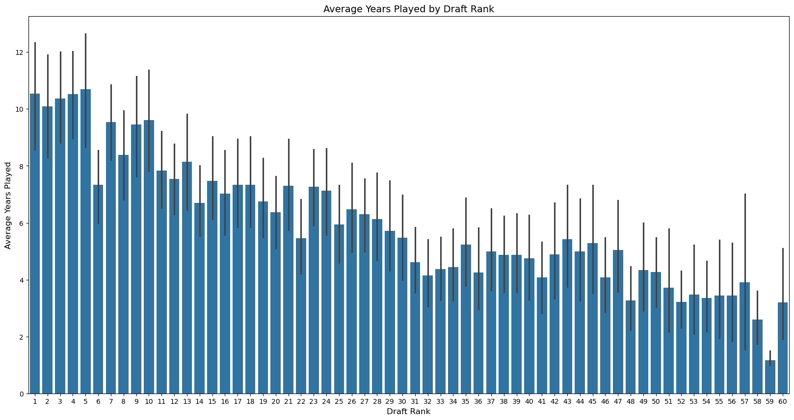
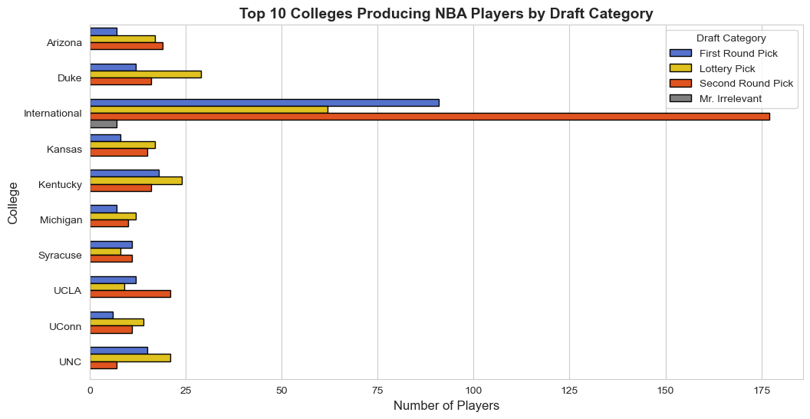

```python
import pandas as pd
import matplotlib.pyplot as plt
import seaborn as sns
```


```python
nba = pd.read_csv('nbaplayersdraft.csv')
```

# Small Summary of the Data

## Top 10 Rows of the Dataset


```python
nba.tail(100)
```


<div>
<style scoped>
    .dataframe tbody tr th:only-of-type {
        vertical-align: middle;
    }

    .dataframe tbody tr th {
        vertical-align: top;
    }

    .dataframe thead th {
        text-align: right;
    }
</style>
<table border="1" class="dataframe">
  <thead>
    <tr style="text-align: right;">
      <th></th>
      <th>id</th>
      <th>year</th>
      <th>rank</th>
      <th>overall_pick</th>
      <th>team</th>
      <th>player</th>
      <th>college</th>
      <th>years_active</th>
      <th>games</th>
      <th>minutes_played</th>
      <th>...</th>
      <th>3_point_percentage</th>
      <th>free_throw_percentage</th>
      <th>average_minutes_played</th>
      <th>points_per_game</th>
      <th>average_total_rebounds</th>
      <th>average_assists</th>
      <th>win_shares</th>
      <th>win_shares_per_48_minutes</th>
      <th>box_plus_minus</th>
      <th>value_over_replacement</th>
    </tr>
  </thead>
  <tbody>
    <tr>
      <th>1822</th>
      <td>1823</td>
      <td>2020</td>
      <td>21</td>
      <td>21</td>
      <td>PHI</td>
      <td>Tyrese Maxey</td>
      <td>Kentucky</td>
      <td>2.0</td>
      <td>136.0</td>
      <td>3585.0</td>
      <td>...</td>
      <td>0.396</td>
      <td>0.867</td>
      <td>26.4</td>
      <td>13.2</td>
      <td>2.5</td>
      <td>3.2</td>
      <td>9.2</td>
      <td>0.123</td>
      <td>0.0</td>
      <td>1.9</td>
    </tr>
    <tr>
      <th>1823</th>
      <td>1824</td>
      <td>2020</td>
      <td>22</td>
      <td>22</td>
      <td>DEN</td>
      <td>Zeke Nnaji</td>
      <td>Arizona</td>
      <td>2.0</td>
      <td>83.0</td>
      <td>1095.0</td>
      <td>...</td>
      <td>0.439</td>
      <td>0.663</td>
      <td>13.2</td>
      <td>4.9</td>
      <td>2.6</td>
      <td>0.3</td>
      <td>2.7</td>
      <td>0.116</td>
      <td>-2.1</td>
      <td>0.0</td>
    </tr>
    <tr>
      <th>1824</th>
      <td>1825</td>
      <td>2020</td>
      <td>23</td>
      <td>23</td>
      <td>NYK</td>
      <td>Leandro Bolmaro</td>
      <td>NaN</td>
      <td>1.0</td>
      <td>35.0</td>
      <td>241.0</td>
      <td>...</td>
      <td>0.278</td>
      <td>0.846</td>
      <td>6.9</td>
      <td>1.4</td>
      <td>1.2</td>
      <td>0.6</td>
      <td>0.0</td>
      <td>0.004</td>
      <td>-5.8</td>
      <td>-0.2</td>
    </tr>
    <tr>
      <th>1825</th>
      <td>1826</td>
      <td>2020</td>
      <td>24</td>
      <td>24</td>
      <td>MIL</td>
      <td>R.J. Hampton</td>
      <td>NaN</td>
      <td>2.0</td>
      <td>115.0</td>
      <td>2290.0</td>
      <td>...</td>
      <td>0.337</td>
      <td>0.653</td>
      <td>19.9</td>
      <td>7.3</td>
      <td>3.2</td>
      <td>2.1</td>
      <td>0.2</td>
      <td>0.005</td>
      <td>-4.0</td>
      <td>-1.1</td>
    </tr>
    <tr>
      <th>1826</th>
      <td>1827</td>
      <td>2020</td>
      <td>25</td>
      <td>25</td>
      <td>OKC</td>
      <td>Immanuel Quickley</td>
      <td>Kentucky</td>
      <td>2.0</td>
      <td>142.0</td>
      <td>3045.0</td>
      <td>...</td>
      <td>0.365</td>
      <td>0.885</td>
      <td>21.4</td>
      <td>11.4</td>
      <td>2.7</td>
      <td>2.8</td>
      <td>7.5</td>
      <td>0.118</td>
      <td>0.5</td>
      <td>1.9</td>
    </tr>
    <tr>
      <th>...</th>
      <td>...</td>
      <td>...</td>
      <td>...</td>
      <td>...</td>
      <td>...</td>
      <td>...</td>
      <td>...</td>
      <td>...</td>
      <td>...</td>
      <td>...</td>
      <td>...</td>
      <td>...</td>
      <td>...</td>
      <td>...</td>
      <td>...</td>
      <td>...</td>
      <td>...</td>
      <td>...</td>
      <td>...</td>
      <td>...</td>
      <td>...</td>
    </tr>
    <tr>
      <th>1917</th>
      <td>1918</td>
      <td>2021</td>
      <td>56</td>
      <td>56</td>
      <td>CHO</td>
      <td>Scottie Lewis</td>
      <td>Florida</td>
      <td>1.0</td>
      <td>2.0</td>
      <td>7.0</td>
      <td>...</td>
      <td>NaN</td>
      <td>0.500</td>
      <td>3.5</td>
      <td>0.5</td>
      <td>0.0</td>
      <td>0.5</td>
      <td>0.0</td>
      <td>0.164</td>
      <td>6.0</td>
      <td>0.0</td>
    </tr>
    <tr>
      <th>1918</th>
      <td>1919</td>
      <td>2021</td>
      <td>57</td>
      <td>57</td>
      <td>CHO</td>
      <td>Balša Koprivica</td>
      <td>Florida State</td>
      <td>NaN</td>
      <td>NaN</td>
      <td>NaN</td>
      <td>...</td>
      <td>NaN</td>
      <td>NaN</td>
      <td>NaN</td>
      <td>NaN</td>
      <td>NaN</td>
      <td>NaN</td>
      <td>NaN</td>
      <td>NaN</td>
      <td>NaN</td>
      <td>NaN</td>
    </tr>
    <tr>
      <th>1919</th>
      <td>1920</td>
      <td>2021</td>
      <td>58</td>
      <td>58</td>
      <td>NYK</td>
      <td>Jericho Sims</td>
      <td>Texas</td>
      <td>1.0</td>
      <td>41.0</td>
      <td>555.0</td>
      <td>...</td>
      <td>NaN</td>
      <td>0.414</td>
      <td>13.5</td>
      <td>2.2</td>
      <td>4.1</td>
      <td>0.5</td>
      <td>1.5</td>
      <td>0.128</td>
      <td>-1.7</td>
      <td>0.0</td>
    </tr>
    <tr>
      <th>1920</th>
      <td>1921</td>
      <td>2021</td>
      <td>59</td>
      <td>59</td>
      <td>BRK</td>
      <td>RaiQuan Gray</td>
      <td>Florida State</td>
      <td>NaN</td>
      <td>NaN</td>
      <td>NaN</td>
      <td>...</td>
      <td>NaN</td>
      <td>NaN</td>
      <td>NaN</td>
      <td>NaN</td>
      <td>NaN</td>
      <td>NaN</td>
      <td>NaN</td>
      <td>NaN</td>
      <td>NaN</td>
      <td>NaN</td>
    </tr>
    <tr>
      <th>1921</th>
      <td>1922</td>
      <td>2021</td>
      <td>60</td>
      <td>60</td>
      <td>IND</td>
      <td>Georgios Kalaitzakis</td>
      <td>NaN</td>
      <td>1.0</td>
      <td>13.0</td>
      <td>214.0</td>
      <td>...</td>
      <td>0.385</td>
      <td>0.467</td>
      <td>16.5</td>
      <td>6.6</td>
      <td>1.6</td>
      <td>0.9</td>
      <td>-0.1</td>
      <td>-0.024</td>
      <td>-7.0</td>
      <td>-0.3</td>
    </tr>
  </tbody>
</table>
<p>100 rows × 24 columns</p>
</div>


```python
nba.describe()
```


<div>
<style scoped>
    .dataframe tbody tr th:only-of-type {
        vertical-align: middle;
    }

    .dataframe tbody tr th {
        vertical-align: top;
    }

    .dataframe thead th {
        text-align: right;
    }
</style>
<table border="1" class="dataframe">
  <thead>
    <tr style="text-align: right;">
      <th></th>
      <th>id</th>
      <th>year</th>
      <th>rank</th>
      <th>overall_pick</th>
      <th>years_active</th>
      <th>games</th>
      <th>minutes_played</th>
      <th>points</th>
      <th>total_rebounds</th>
      <th>assists</th>
      <th>...</th>
      <th>3_point_percentage</th>
      <th>free_throw_percentage</th>
      <th>average_minutes_played</th>
      <th>points_per_game</th>
      <th>average_total_rebounds</th>
      <th>average_assists</th>
      <th>win_shares</th>
      <th>win_shares_per_48_minutes</th>
      <th>box_plus_minus</th>
      <th>value_over_replacement</th>
    </tr>
  </thead>
  <tbody>
    <tr>
      <th>count</th>
      <td>1922.000000</td>
      <td>1922.000000</td>
      <td>1922.000000</td>
      <td>1922.000000</td>
      <td>1669.000000</td>
      <td>1669.000000</td>
      <td>1669.000000</td>
      <td>1669.000000</td>
      <td>1669.000000</td>
      <td>1669.000000</td>
      <td>...</td>
      <td>1545.000000</td>
      <td>1633.000000</td>
      <td>1669.000000</td>
      <td>1669.000000</td>
      <td>1669.000000</td>
      <td>1669.000000</td>
      <td>1669.000000</td>
      <td>1668.000000</td>
      <td>1668.000000</td>
      <td>1669.000000</td>
    </tr>
    <tr>
      <th>mean</th>
      <td>961.500000</td>
      <td>2005.317378</td>
      <td>29.694589</td>
      <td>29.694589</td>
      <td>6.332534</td>
      <td>348.042540</td>
      <td>8399.055722</td>
      <td>3580.413421</td>
      <td>1497.009587</td>
      <td>774.300779</td>
      <td>...</td>
      <td>0.272405</td>
      <td>0.716825</td>
      <td>18.134032</td>
      <td>7.275734</td>
      <td>3.194368</td>
      <td>1.550749</td>
      <td>17.873697</td>
      <td>0.061691</td>
      <td>-2.311271</td>
      <td>4.403176</td>
    </tr>
    <tr>
      <th>std</th>
      <td>554.977927</td>
      <td>9.456946</td>
      <td>16.912454</td>
      <td>16.912454</td>
      <td>4.656321</td>
      <td>324.897567</td>
      <td>9845.871529</td>
      <td>4826.142847</td>
      <td>2003.686388</td>
      <td>1284.602969</td>
      <td>...</td>
      <td>0.128339</td>
      <td>0.118702</td>
      <td>8.707656</td>
      <td>4.969343</td>
      <td>2.083895</td>
      <td>1.488536</td>
      <td>27.989805</td>
      <td>0.094467</td>
      <td>4.143403</td>
      <td>11.461729</td>
    </tr>
    <tr>
      <th>min</th>
      <td>1.000000</td>
      <td>1989.000000</td>
      <td>1.000000</td>
      <td>1.000000</td>
      <td>1.000000</td>
      <td>1.000000</td>
      <td>0.000000</td>
      <td>0.000000</td>
      <td>0.000000</td>
      <td>0.000000</td>
      <td>...</td>
      <td>0.000000</td>
      <td>0.000000</td>
      <td>0.000000</td>
      <td>0.000000</td>
      <td>0.000000</td>
      <td>0.000000</td>
      <td>-1.700000</td>
      <td>-1.264000</td>
      <td>-52.000000</td>
      <td>-8.500000</td>
    </tr>
    <tr>
      <th>25%</th>
      <td>481.250000</td>
      <td>1997.000000</td>
      <td>15.000000</td>
      <td>15.000000</td>
      <td>2.000000</td>
      <td>72.000000</td>
      <td>838.000000</td>
      <td>265.000000</td>
      <td>128.000000</td>
      <td>46.000000</td>
      <td>...</td>
      <td>0.222000</td>
      <td>0.659000</td>
      <td>11.000000</td>
      <td>3.400000</td>
      <td>1.700000</td>
      <td>0.500000</td>
      <td>0.400000</td>
      <td>0.030000</td>
      <td>-3.900000</td>
      <td>-0.400000</td>
    </tr>
    <tr>
      <th>50%</th>
      <td>961.500000</td>
      <td>2005.000000</td>
      <td>30.000000</td>
      <td>30.000000</td>
      <td>5.000000</td>
      <td>235.000000</td>
      <td>4204.000000</td>
      <td>1552.000000</td>
      <td>656.000000</td>
      <td>257.000000</td>
      <td>...</td>
      <td>0.317000</td>
      <td>0.736000</td>
      <td>17.700000</td>
      <td>6.200000</td>
      <td>2.800000</td>
      <td>1.100000</td>
      <td>5.300000</td>
      <td>0.069000</td>
      <td>-2.000000</td>
      <td>0.000000</td>
    </tr>
    <tr>
      <th>75%</th>
      <td>1441.750000</td>
      <td>2013.000000</td>
      <td>44.000000</td>
      <td>44.000000</td>
      <td>10.000000</td>
      <td>584.000000</td>
      <td>13246.000000</td>
      <td>5150.000000</td>
      <td>2139.000000</td>
      <td>910.000000</td>
      <td>...</td>
      <td>0.356000</td>
      <td>0.797000</td>
      <td>24.800000</td>
      <td>10.000000</td>
      <td>4.200000</td>
      <td>2.100000</td>
      <td>24.500000</td>
      <td>0.104000</td>
      <td>-0.300000</td>
      <td>4.500000</td>
    </tr>
    <tr>
      <th>max</th>
      <td>1922.000000</td>
      <td>2021.000000</td>
      <td>60.000000</td>
      <td>60.000000</td>
      <td>22.000000</td>
      <td>1541.000000</td>
      <td>52139.000000</td>
      <td>37062.000000</td>
      <td>15091.000000</td>
      <td>12091.000000</td>
      <td>...</td>
      <td>1.000000</td>
      <td>1.000000</td>
      <td>41.100000</td>
      <td>27.200000</td>
      <td>13.300000</td>
      <td>9.500000</td>
      <td>249.500000</td>
      <td>1.442000</td>
      <td>51.100000</td>
      <td>142.600000</td>
    </tr>
  </tbody>
</table>
<p>8 rows × 21 columns</p>
</div>


# Nulls Within the Database
The following is a summary of the frequency of nulls within the database


```python
null_counts = nba.isnull().sum()

print(null_counts)
```

    id                             0
    year                           0
    rank                           0
    overall_pick                   0
    team                           0
    player                         0
    college                      337
    years_active                 253
    games                        253
    minutes_played               253
    points                       253
    total_rebounds               253
    assists                      253
    field_goal_percentage        257
    3_point_percentage           377
    free_throw_percentage        289
    average_minutes_played       253
    points_per_game              253
    average_total_rebounds       253
    average_assists              253
    win_shares                   253
    win_shares_per_48_minutes    254
    box_plus_minus               254
    value_over_replacement       253
    dtype: int64
    


```python
plt.figure(figsize=(15,5))
plt.bar(null_counts.index, null_counts.values)
plt.xlabel("Columns")
plt.ylabel("Number of Nulls")
plt.title("Null Values per Column")
plt.xticks(rotation=90)
plt.show()
```


    

    


# Summarizations of the Data

## Number of Players by Years Active

This graph show the amount of years played by each player that was drafted between the years 1989 and 2021

*note: players that joined the NBA while going undrafted are not shown (e.g. a player that was signed in their first year and not drafted)*


```python
nba['years_active'].hist(bins=20)
plt.title('Number of Players by Years Active')
plt.xlabel('# of Years Played')
plt.ylabel('# of Players')
plt.show()
```


    

    


## Average Number of Years Played by Pick Type
"Pick type" is a term that refers to when a player was drafted into the NBA:
- Top 15 = Lottery
- 15-30 = First Round Pick
- 30-59 = Second Round Pick
- 60 = Mr. Irrelevant

Using this classification system I wanted to find out if a player drafted last or in the "Mr. Irrelevant" spot had more staying power in the NBA. This was on average not the case however, there was found to be higher variablility in the amount of years a "Mr. Irrelevant" stayed in the NBA when compared to other "Second Round Picks". This could be explained by the lower sample size due to only sampling a single player in each draft compared to 29 players in the "Second Round Picks" category.


```python
def pick_group(overall_pick):
    if overall_pick < 16:
        return "Lottery Pick"
    elif 16 <= overall_pick < 31:
        return "First Round Pick"
    elif overall_pick == 60:
        return "Mr. Irrelevant"
    elif overall_pick >= 31:
        return "Second Round Pick"

    
nba['Pick_Type'] = nba['overall_pick'].apply(pick_group)
```


```python
plt.figure(figsize=(8,5))
sns.barplot(x=nba['Pick_Type'], y=nba['years_active'])

plt.title('Average Years Played by Draft Pick Category', fontsize=14)
plt.xlabel('Draft Pick Category', fontsize=12)
plt.ylabel('Average Years Played', fontsize=12)
```


    Text(0, 0.5, 'Average Years Played')


    

    


## Average Years Played by Draft Rank (Who is the Real "Mr. Irrelevant"?)
After seeing the sample size issue caused by using the pick type I wanted to find out which pick number was most likely to produce a player that dropped out of the NBA the fastest, as the general consensus is the deeper you go into the draft the more likely you are to draft a "bad player" (in this case a "bad player" is a player that could not stay in the NBA for an extended amount of time).


```python
plt.figure(figsize=(20,10))
sns.barplot(x=nba['overall_pick'], y=nba['years_active'])

plt.title('Average Years Played by Draft Rank', fontsize=14)
plt.xlabel('Draft Rank', fontsize=12)
plt.ylabel('Average Years Played', fontsize=12)
```


    Text(0, 0.5, 'Average Years Played')


    

    


As shown above, the last pick in the NBA is not the worst pick on average (when using years active as your metric). The worst pick to have in the NBA draft would be the 59th pick followed by the 58th pick. Thus, crowning the real "Mr. Irrelevant" as the 59th pick. Again I would like to reiterate that "best" and "worst" were measured by how long a player lasted in the NBA and it might (definitely) not be the best way to track how valueble a pick would have been as it would not include:
- How well a player actually played.
- If media attention gained by being "Mr. Irrelevant" lengthened a player's career.
- Etc.

Additionally, the 5th pick seemed to produce players that stay in the NBA the longest something I would not have expected.


# Number of Players Picked by Draft Location
*To provide some understanding to the null values under the "college" players with NaN values are replaced by "International" as the NBA classifies anyone that did not graduate a D1-3 college as an "International" player*


```python
nba['college'] = nba['college'].fillna('International')
cg = nba.groupby('college').size().nlargest(10)
print(cg)
```

    college
    International    337
    Kentucky          58
    Duke              57
    Arizona           43
    UNC               43
    UCLA              42
    Kansas            40
    UConn             31
    Syracuse          30
    Michigan          29
    dtype: int64
    

# Top 10 Colleges Producing NBA Players
The following graph shows the top 10 ten colleges *including international players*  as well as their "pick type" splits


```python
nba['college'] = nba['college'].fillna('International')

cg = nba.groupby(['college', 'Pick_Type']).size().reset_index(name='count')

top_colleges = nba['college'].value_counts().nlargest(10).index
cg = cg[cg['college'].isin(top_colleges)]

sns.set_style("whitegrid")

palette = {
    "Lottery Pick": "gold",
    "First Round Pick": "royalblue",
    "Second Round Pick": "orangered",
    "Mr. Irrelevant": "gray"
}

plt.figure(figsize=(12, 6))

sns.barplot(
    data=cg,
    x='count',
    y='college',
    hue='Pick_Type',
    palette=palette,
    edgecolor="black"
)

plt.title("Top 10 Colleges Producing NBA Players by Draft Category", fontsize=14, fontweight='bold')
plt.xlabel("Number of Players", fontsize=12)
plt.ylabel("College", fontsize=12)
plt.xticks(fontsize=10)
plt.yticks(fontsize=10)
plt.legend(title="Draft Category")

plt.show()

```


    

    

